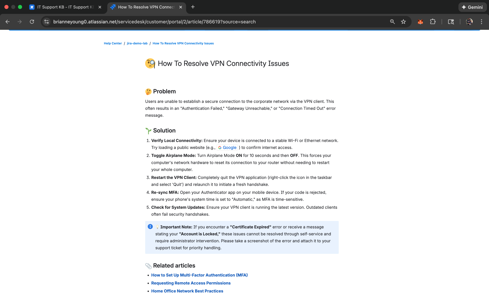

# Jira Service Management: Building a Professional Help Desk

## What is this project?
I built this lab to simulate how a professional IT department handles requests, fixes problems, and shares knowledge. Instead of just fixing things randomly, I set up a structured system using **Jira Service Management** to track every issue from start to finish.

This project shows I can manage a "ticketing system," stay organized under pressure, and create helpful guides for users so they can solve their own problems.

## The Tools I Used
- **Jira Service Management:** The "command center" where all tech requests (tickets) come in.
- **Confluence:** The "library" where I wrote helpful "How-to" guides for users.
- **SLA (Service Level Agreements):** The "timer" that ensures I fix problems quickly.

---

## What I Did (Step-by-Step)

### 1. Setting Up the "Front Desk" (The Portal)
I created a customer portal where employees can go to report a broken laptop or request new software. I learned how to categorize these requests so they automatically go to the right person.

 
<em>This is what the user sees when they need help!</em>

---

### 2. Beating the Clock (SLA Management)
In a professional office, some problems are more urgent than others. I set up **SLAs (Service Level Agreements)**—which are basically "count-down timers"—to make sure high-priority issues get fixed fast. This keeps the IT team accountable and makes sure no one is waiting too long for help.

  
  
   
  <em>Left: Building the 2-hour "Time to Resolution" timer | Right: The live timer counting down on a real ticket.</em>

---

### 3. Beating the Clock (SLA Management)
In IT, some problems are more urgent than others. I set up **SLAs (Service Level Agreements)**—basically a countdown timer—to make sure I was fixing high-priority issues (like a server being down) faster than low-priority ones (like a missing mousepad).

 
<em>Making sure I finish my work before the timer runs out!</em>

---

### 4. Building the "Help Yourself" Library (Confluence)
I used **Confluence** to create a "Knowledge Base." I wrote a step-by-step guide for common issues like VPN errors so users can find answers without even opening a ticket. This is called **Ticket Deflection**, and it’s a win-win: the user gets a fast answer, and the IT team stays focused on bigger projects.

  
  
   
  <em>Left: Setting up the library | Right: The system suggesting my guide when a user types "VPN."</em>

 
<em>The finished guide: A professional "Problem vs. Solution" article I authored.</em>

---

## Key Concepts I Learned
- **Ticketing Systems:** How to keep a busy IT department organized.
- **Prioritization:** Knowing which "fire" to put out first.
- **Effective Documentation:** Writing clear notes so the rest of the team knows what I did.
- **Customer Empathy:** Making the process easy and friendly for the person who is stressed because their computer isn't working.

  ---

## Conclusion: Putting it All Together

Before this lab, I thought "Help Desk" just meant answering phones and fixing computers. After building this environment, I realize it is actually about **management and communication**. 

By using Jira and Confluence together, I learned how to:
1. **Stay Organized:** I can track multiple problems at once without anything falling through the cracks.
2. **Be Proactive:** By writing guides in Confluence, I’m actually preventing future tickets before they even happen.
3. **Value the User’s Time:** Using SLAs taught me that in a fast-paced environment (like healthcare or retail), every minute of downtime matters.

This lab has given me the confidence to step into a professional IT team and contribute to a smooth, organized, and helpful service desk experience.
