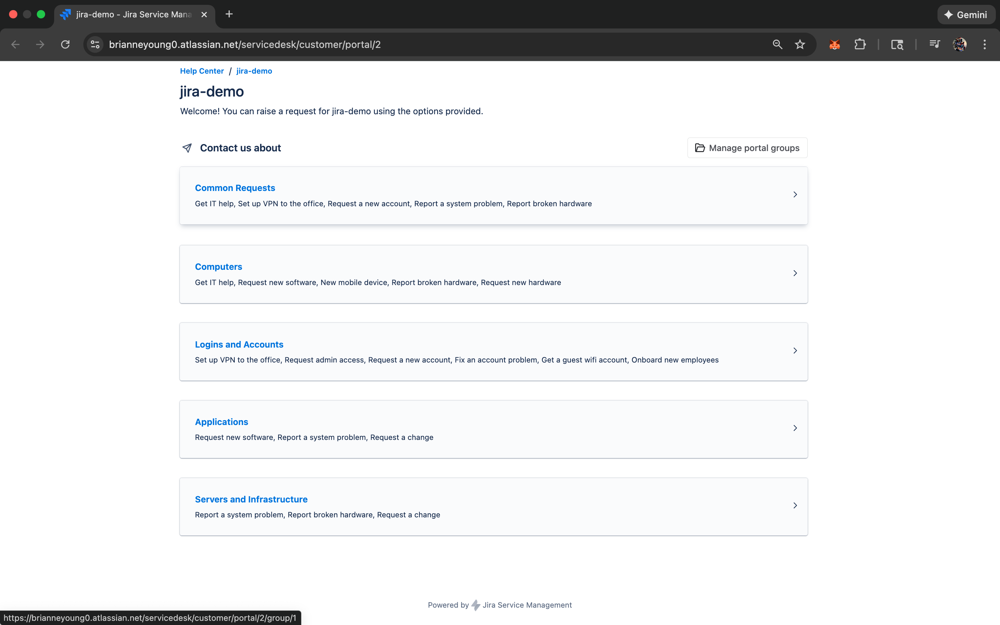
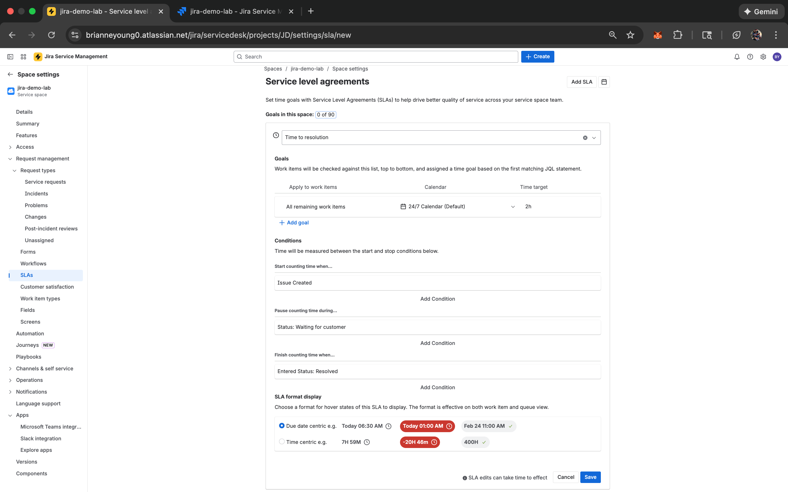
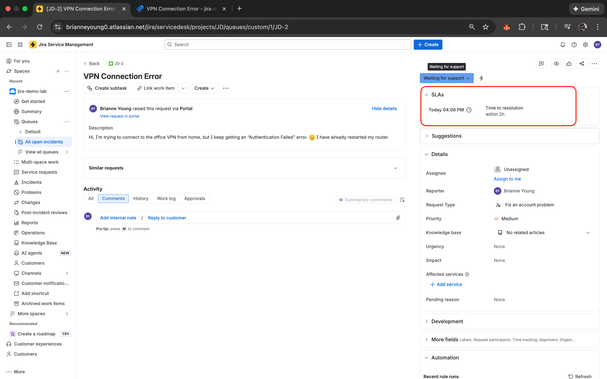
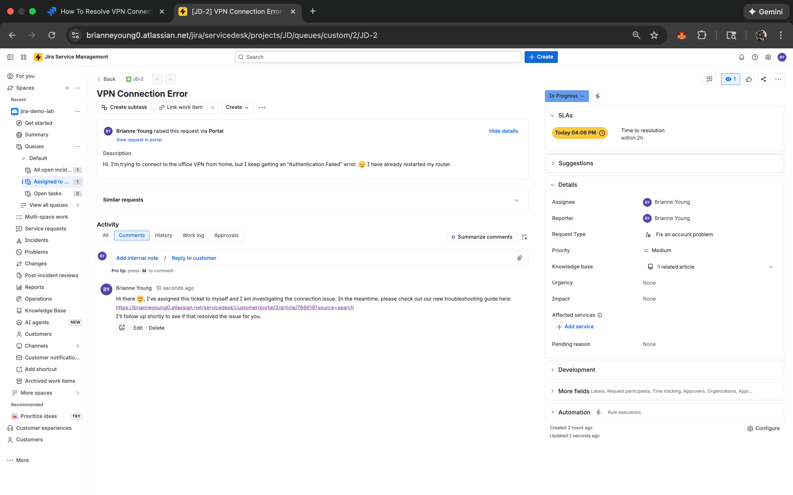
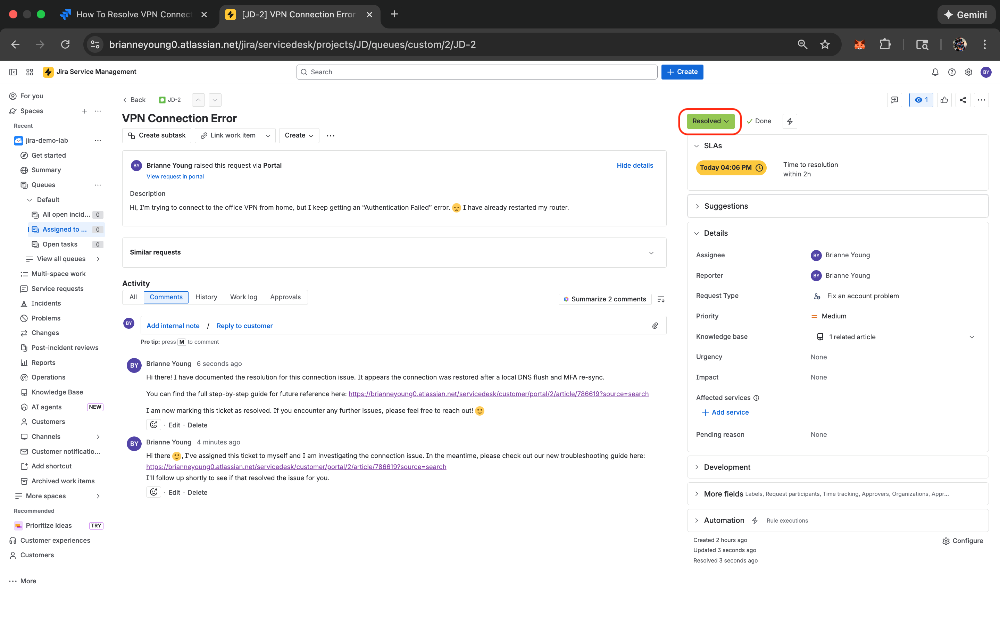
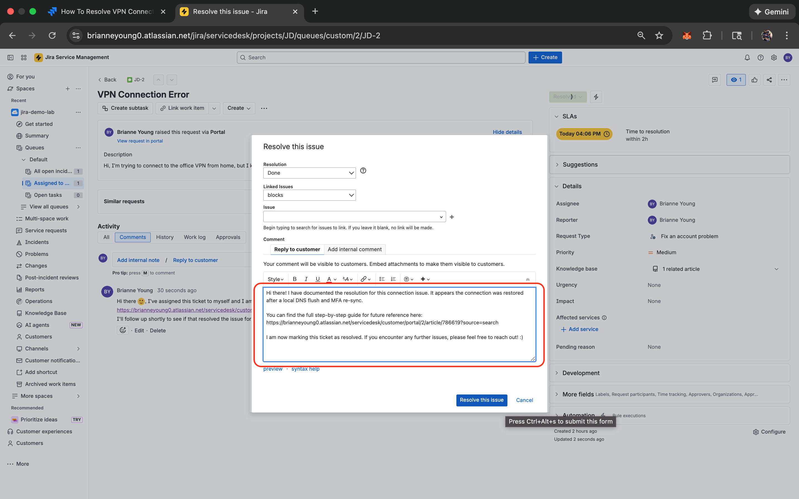
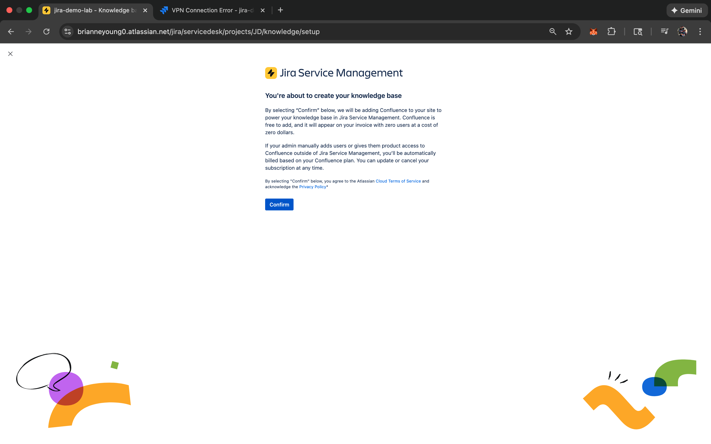
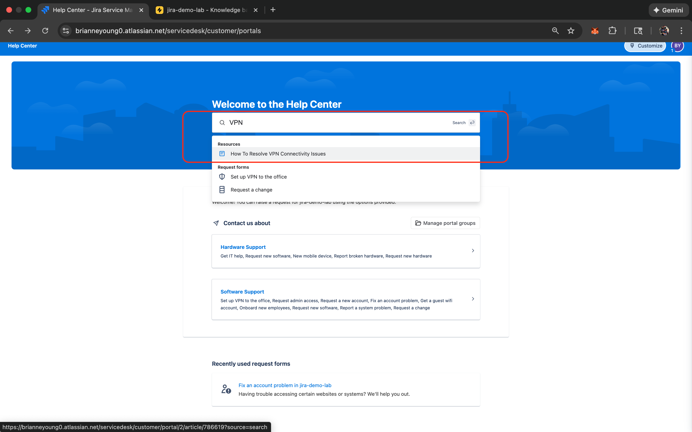

# Jira Service Management: Building a Professional Help Desk

## What is this project?
I built this lab to simulate how a professional IT department handles requests, fixes problems, and shares knowledge. Instead of just fixing things randomly, I set up a structured system using **Jira Service Management** to track every issue from start to finish.

## The Tools I Used
- **Jira Service Management:** The "command center" where all tech requests (tickets) come in.
- **Confluence:** The "library" where I wrote helpful "How-to" guides for users.
- **SLA (Service Level Agreements):** The "timer" that ensures I fix problems quickly.

---

## What I Did (Step-by-Step)

### 1. Setting Up the "Front Desk" (The Portal)
I created a customer portal where employees can go to report a broken laptop or request new software. I learned how to categorize these requests so they automatically go to the right person.

 
<em>This is what the user sees when they need help!</em>

---

### 2. Beating the Clock (SLA Management)
In a professional office, some problems are more urgent than others. I set up **SLAs (Service Level Agreements)**—which are basically "count-down timers"—to make sure high-priority issues get fixed fast. 

  
  
   
  <em>Left: Building the 2-hour "Time to Resolution" timer | Right: The live timer counting down on a real ticket.</em>

---

### 3. Managing the Workflow (Solving Tickets)
I practiced taking "tickets" through their full journey: **To Do → In Progress → Resolved.** This taught me how to document my work and keep the user informed so they aren't left wondering when their computer will be fixed.

  
  
  
   
  <em>Left: Moving to "In Progress" | Middle: Updating the user with a comment | Right: Marking as "Resolved."</em>

---

### 4. Building the "Help Yourself" Library (Confluence)
I used **Confluence** to create a "Knowledge Base." I wrote a step-by-step guide for common issues like VPN errors so users can find answers without even opening a ticket. This is called **Ticket Deflection**.

  
  
   
  <em>Left: Setting up the library | Right: The system suggesting my guide when a user types "VPN."</em>

 
<em>The finished guide: A professional "Problem vs. Solution" article I authored.</em>

---

## Key Concepts I Learned
- **Ticketing Systems:** How to keep a busy IT department organized.
- **Prioritization:** Knowing which "fire" to put out first.
- **Effective Documentation:** Writing clear notes so the rest of the team knows what I did.
- **Customer Empathy:** Making the process easy and friendly for the person who is stressed.

---

## Conclusion: Putting it All Together
Before this lab, I thought "Help Desk" just meant answering phones and fixing computers. After building this environment, I realize it is actually about **management and communication**. By using Jira and Confluence together, I learned how to stay organized, be proactive, and value the user’s time.
